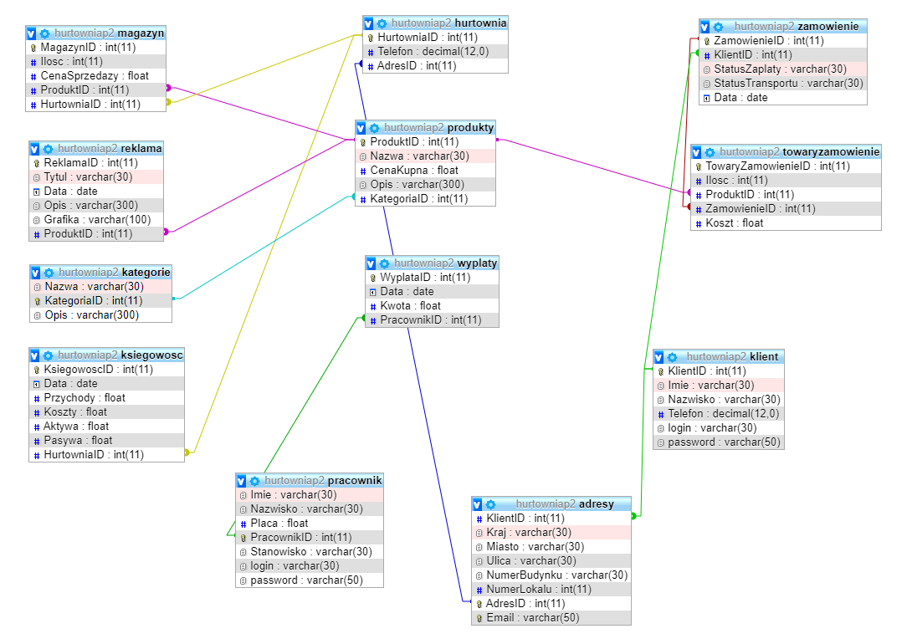
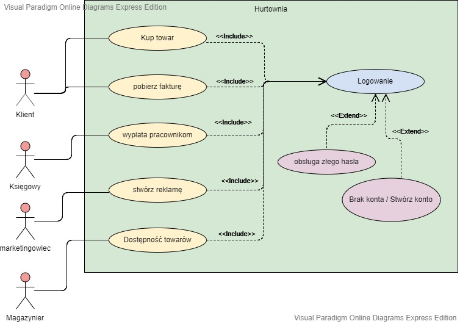
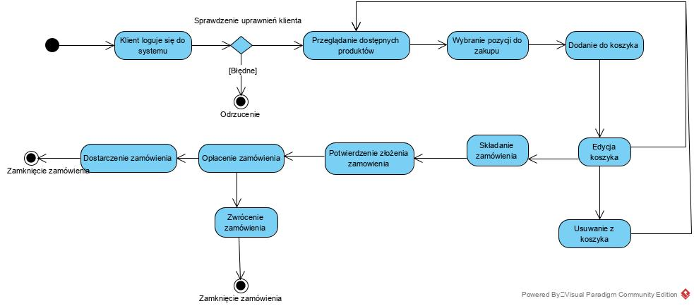

# HURTOWNIA

### Diagram zależności tabel w bazie danych projektu

### Diagram przypadków uzycia

### Diagram aktywności

### Diagramy sekwencji

#### Diagram sekwencji Klienta

#### Diagram sekwencji Admina

#### Diagram sekwencji Magazniera

#### Diagram sekwencji Księgowej

#### Diagram sekwencji Kierownika

---

## Aby uruchomić program należy:

### 1. uruchomić go w środowisku NetBeans IDE wersja 8

### 2. Dodać plik z folderu jar:

#### Prawy przycisk myszy na nazwę projektu > Properties > Libraries > Add JAR/Folder > wybrać plik > OK
