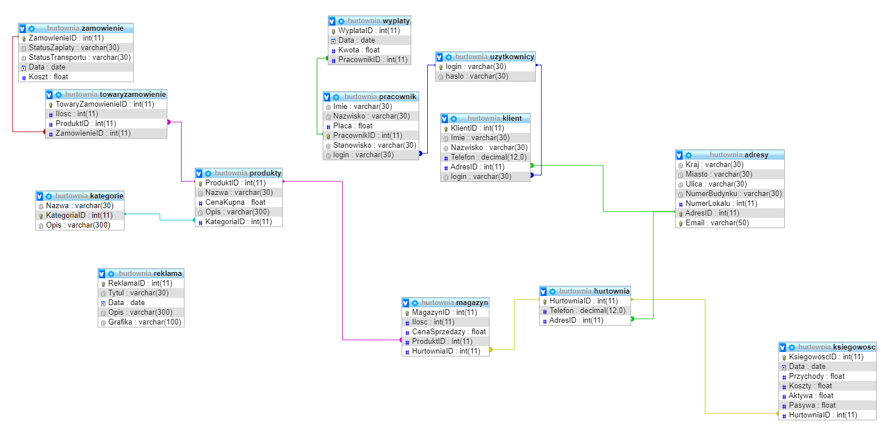

#                                                              HURTOWNIA

### Diagram zależności tabel w bazie danych projektu

### Diagram przypadków uzycia

***

## Aby uruchomić program należy:
 1. uruchomić go w środowisku NetBeans IDE wersja 8
 2. Dodać plik z folderu jar:
 
 ⋅⋅⋅ Prawy przycisk myszy na nazwę projektu > Properties > Libraries > Add JAR/Folder > wybrać plik > OK ⋅⋅⋅
